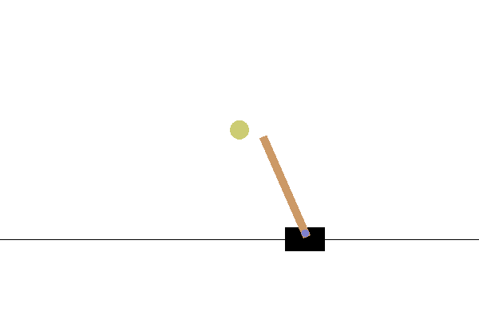

# Simplex-Cartpole


---

This repo implements the cartpole framework in simulation to validate the feasibility of Simplex-enabled Continual (
SeC) - Learning Machine for safety critical systems.

## Table of Content

* [Code Structure](#code-structure)
* [Environment Setup](#environment-setup)
* [Experiment](#pretrain-a-policy)
    * [Pretrain a Policy](#pretrain-a-policy)
    * [Continual Learning](#continual-learning)
    * [Results]()
* [Misc](#misc)

---

## Code Structure

In the codebase, [Hydra](https://hydra.cc/) is utilized for configuring hyperparameters in YAML style. The structure is
formatted as follows:

```
├── config                                <- Configure files for the framework
├── results   
│      ├── hydra                          <- Hydra log for each runtime
│      ├── logs                           <- Logs for training/testing/evaluation
│      ├── models                         <- Trained weights files
│      └── plots                          <- Plots for cartpole phase/trajectory
├── scripts                              
│      ├── test                           <- For testing
│      └── train                          <- For training
│           ├── pretrain.sh                   <- Pretain a policy using Phy-DRL
│           ├── seclm_safe_learn.sh           <- Continual learn with seclm
│           ├── seclm_safe_only.sh            <- Continual learn with seclm (only use seclm for safety)
│           └── unsafe_continual_learn.sh     <- Continual learn without seclm (no safety guarantee)
├── src                              
│    ├── envs                             <- Environment of real plant (cartpole)
│    ├── ha_teacher                  
│           ├── matlab                    <- m files for solving LMIs
│           ├── ha_teacher.py             <- High Assurance Teacher
│           └── mat_engine.py             <- Matlab engine interface
│    ├── hp_student                               
│           ├── agents                    <- Phy-DRL agent (High Performance Student)
│           ├── networks                  <- Phy-DRL network structure
│           └── ... 
│    ├── trainer                  
│           └── trainer.py                <- Training/Testing/Evaluation loop                               
│    ├── ... 
│    └── physical_design.py               <- Physical matrix design for cartpole     
├── main.py                               <- Main file
└── requirements.txt                      <- Depencencies for code environment                      
```

## Environment Setup

It is recommended to create a conda environment for development. The required packages have been tested under Python
3.9.5, though they should be compatible with other Python
versions.

### Python Package

Follow the steps below to build the Python environment:

1. First, download the appropriate version of [Anaconda](https://www.anaconda.com/download/success). After installation,
   create a virtual environment:
   ```bash
   conda create --name cartpole python==3.9.5
   ```
2. Second, activate the conda environment you created:
   ```bash
   conda activate cartpole
   ```
3. Finally, install all dependent packages by running:

   ```bash
   pip install -r requirements.txt
   ```

### Matlab Interface

The LMIs need matlab for computation. Please install [matlab](https://mathworks.com/downloads/) and check
the [requirements](https://www.mathworks.com/support/requirements/python-compatibility.html) to ensure your python
version is compatible with the installed matlab version. After that, build MATLAB Engine API for Python:

1. Find the folder under matlab root path:
   ```bash
   cd <matlab_root>\extern\engines\python
   ```

2. Use pip to install:
   ```bash
   python -m pip install .
   ```

## Experiment

### Pretrain a Policy

---

Use Phy-DRL to pretrain a policy in a friction-free environment (around 1 million steps):

   ```bash
   bash scripts/train/pretrain.sh
   ```

You can observe the training status using tensorboard:

   ```bash
   tensorboard --logdir ./results/logs
   ```

To test the trained Phy-DRL policy, assign the model path for `CHECKPOINT` in the `scripts/test/pretrain.sh` and run
command:

   ```bash
   bash scripts/test/pretrain.sh
   ```

The cartpole system will safely converge to the set point using control action from Phy-DRL agent:

<p align="center">
   
</p>

We now create a more real environment by introducing frictions and actuator noises: in `scripts/test/pretrain.sh`,
set `WITH_FRICTION` and `ACTUATOR_NOISE` to be `true`, run the script again. You will find that, due to the
'sim-to-real' gap, the system will fail within the same initial condition:

<p align="center">
   
</p>

### Continual Learning

---

#### 1. Unsafe continual learning

Continual learning without safety guarantee:

   ```bash
   bash scripts/train/unsafe_continual_learn.sh 
  ```

#### 2. SeCLM only for safety

Use SeCLM for continual learning, the teacher only guarantees safety (Agent doesn't learn from teacher's behavior):

   ```bash
   bash scripts/train/seclm_safe_only.sh 
  ```

#### 3. SeCLM for safe continual learning

Use SeCLM for continual learning, the teacher guarantees safety and agent learns from teacher's behavior:

   ```bash
   bash scripts/train/seclm_safe_learn.sh 
  ```

The teacher in SeCLM will always provide safety guarantee for the student (agent) during continual learning:
<p align="center">
   
</p>

### Results

---

To show the agent's learning performance with SeCLM, we select the same (unsafe) initial condition and continual train
for 10 episodes, either with or without SeCLM.

- #### Unsafe Learn

For the first 10 episodes, the system would always fail and the agent couldn't collect good data to learn a safe policy:
<p align="center">
   
</p>

- #### SeCLM

For testing, we disable the teacher module, and result shows that the agent learns the safe behavior from teacher:
<p align="center">
   
</p>

## Misc

---

- To plot cartpole `phase/trajectory` or live show its `animation/trajectory`, check corresponding fields
  in `config/logger/logger.yaml`

